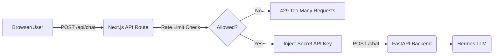

# Spec Next.js Chat Widget Integration (GalonKu)

Dokumen ini berisi spesifikasi teknis dan implementasi untuk mengintegrasikan AI Chat Assistant di landing page Next.js `galonku.my.id` dengan backend FastAPI.

## 1. Arsitektur Flow



**Konsep Utama:**

- Browser **tidak pernah** hit FastAPI langsung.
- Browser hit Next.js API Route (`/api/chat`).
- Next.js server bertindak sebagai proxy, menyisipkan `FASTAPI_API_KEY` (secret).
- Rate limit dilakukan di Next.js (Edge/Server).

## 2. Environment Variables

Tambahkan di `.env.local` Next.js:

```env
# URL ke server FastAPI (bukan localhost jika di-deploy terpisah)
FASTAPI_BASE_URL=http://10.254.200.211:8000
# Secret key yang sama dengan yang diset di FastAPI backend
FASTAPI_API_KEY=GalonKuHermes3105
```

> **WARNING:** Jangan pernah pakai prefix `NEXT_PUBLIC_` untuk key ini!

## 3. Dependencies

Pilih salah satu metode rate limiting:

**Opsi A (Recommended untuk Edge/Vercel): Upstash Redis**

```bash
npm install @upstash/redis @upstash/ratelimit
```

**Opsi B (Simple/In-Memory): lru-cache (Hanya untuk VPS/Docker)**

```bash
npm install lru-cache
```

_Untuk UI Component (Opsional tapi disarankan):_

```bash
npm install lucide-react clsx tailwind-merge
```

## 4. Implementasi API Route Proxy

Buat file di `app/api/chat/route.ts` (App Router):

```typescript
import { NextResponse } from "next/server";
// import { Ratelimit } from '@upstash/ratelimit'; // Jika pakai Upstash
// import { Redis } from '@upstash/redis';

// Konfigurasi Rate Limit (Contoh pseudo-code)
// const ratelimit = new Ratelimit({ redis: Redis.fromEnv(), limiter: Ratelimit.slidingWindow(10, '1 m') });

export async function POST(req: Request) {
  try {
    // 1. Dapatkan IP untuk rate limiting
    const ip = req.headers.get("x-forwarded-for") || "anonymous";

    // 2. Cek Rate Limit (Contoh: max 10 request / menit per IP)
    // const { success } = await ratelimit.limit(ip);
    // if (!success) return NextResponse.json({ error: 'Terlalu banyak request. Coba lagi nanti.' }, { status: 429 });

    // 3. Parse request body
    const body = await req.json();
    const { message, session_id } = body;

    if (!message || message.trim() === "") {
      return NextResponse.json(
        { error: "Pesan tidak boleh kosong" },
        { status: 400 },
      );
    }

    if (message.length > 500) {
      return NextResponse.json(
        { error: "Pesan terlalu panjang (max 500 karakter)" },
        { status: 400 },
      );
    }

    // 4. Forward ke FastAPI
    const fastApiUrl = process.env.FASTAPI_BASE_URL;
    const fastApiKey = process.env.FASTAPI_API_KEY;

    if (!fastApiUrl || !fastApiKey) {
      console.error("Missing FASTAPI env vars");
      return NextResponse.json(
        { error: "Server configuration error" },
        { status: 500 },
      );
    }

    const response = await fetch(`${fastApiUrl}/chat`, {
      method: "POST",
      headers: {
        "Content-Type": "application/json",
        // Inject API Key di sini (tidak terlihat oleh user)
        "X-API-Key": fastApiKey,
      },
      body: JSON.stringify({
        message: message,
        session_id: session_id,
      }),
    });

    if (!response.ok) {
      const errorText = await response.text();
      console.error("FastAPI error:", response.status, errorText);
      return NextResponse.json(
        { error: "Gagal menghubungi AI Assistant." },
        { status: response.status },
      );
    }

    const data = await response.json();

    // 5. Kembalikan response ke client
    return NextResponse.json(data);
  } catch (error) {
    console.error("Chat proxy error:", error);
    return NextResponse.json(
      { error: "Internal Server Error" },
      { status: 500 },
    );
  }
}
```

## 5. Implementasi UI Chat Widget (Client Component)

Buat komponen `components/ChatWidget.tsx`:

```tsx
"use client";

import { useState, useRef, useEffect } from "react";

type Message = {
  role: "user" | "assistant";
  content: string;
};

export default function ChatWidget() {
  const [isOpen, setIsOpen] = useState(false);
  const [messages, setMessages] = useState<Message[]>([
    {
      role: "assistant",
      content: "Halo! Ada yang bisa dibantu seputar GalonKu?",
    },
  ]);
  const [input, setInput] = useState("");
  const [isLoading, setIsLoading] = useState(false);
  const [sessionId, setSessionId] = useState<string | null>(null);

  const messagesEndRef = useRef<HTMLDivElement>(null);

  // Auto-scroll ke bawah saat ada pesan baru
  useEffect(() => {
    messagesEndRef.current?.scrollIntoView({ behavior: "smooth" });
  }, [messages]);

  const handleSubmit = async (e: React.FormEvent) => {
    e.preventDefault();
    if (!input.trim() || isLoading) return;

    const userMessage = input.trim();
    setInput("");
    setMessages((prev) => [...prev, { role: "user", content: userMessage }]);
    setIsLoading(true);

    try {
      const res = await fetch("/api/chat", {
        method: "POST",
        headers: { "Content-Type": "application/json" },
        body: JSON.stringify({
          message: userMessage,
          session_id: sessionId,
        }),
      });

      const data = await res.json();

      if (!res.ok) throw new Error(data.error || "Terjadi kesalahan");

      if (data.session_id && !sessionId) {
        setSessionId(data.session_id); // Simpan session id untuk konteks selanjutnya
      }

      setMessages((prev) => [
        ...prev,
        { role: "assistant", content: data.reply },
      ]);
    } catch (error: any) {
      setMessages((prev) => [
        ...prev,
        { role: "assistant", content: `Error: ${error.message}` },
      ]);
    } finally {
      setIsLoading(false);
    }
  };

  return (
    <div className="fixed bottom-4 right-4 z-50">
      {/* Tombol Toggle */}
      {!isOpen && (
        <button
          onClick={() => setIsOpen(true)}
          className="bg-blue-600 hover:bg-blue-700 text-white rounded-full p-4 shadow-lg transition-transform hover:scale-105"
        >
          💬 Chat
        </button>
      )}

      {/* Chat Box */}
      {isOpen && (
        <div className="bg-white rounded-lg shadow-xl w-[350px] h-[500px] flex flex-col border border-gray-200">
          {/* Header */}
          <div className="bg-blue-600 text-white p-4 rounded-t-lg flex justify-between items-center">
            <h3 className="font-semibold">GalonKu Assistant</h3>
            <button
              onClick={() => setIsOpen(false)}
              className="text-white hover:text-gray-200"
            >
              ✕
            </button>
          </div>

          {/* Area Pesan */}
          <div className="flex-1 p-4 overflow-y-auto bg-gray-50 flex flex-col gap-3">
            {messages.map((msg, idx) => (
              <div
                key={idx}
                className={`max-w-[80%] p-3 rounded-lg ${
                  msg.role === "user"
                    ? "bg-blue-600 text-white self-end rounded-br-none"
                    : "bg-white text-gray-800 border border-gray-200 self-start rounded-bl-none shadow-sm"
                }`}
              >
                {msg.content}
              </div>
            ))}
            {isLoading && (
              <div className="bg-white text-gray-800 border border-gray-200 p-3 rounded-lg self-start shadow-sm flex gap-1 items-center">
                <span className="animate-bounce">●</span>
                <span className="animate-bounce delay-100">●</span>
                <span className="animate-bounce delay-200">●</span>
              </div>
            )}
            <div ref={messagesEndRef} />
          </div>

          {/* Form Input */}
          <form
            onSubmit={handleSubmit}
            className="p-3 border-t border-gray-200 bg-white rounded-b-lg flex gap-2"
          >
            <input
              type="text"
              value={input}
              onChange={(e) => setInput(e.target.value)}
              placeholder="Ketik pesan..."
              className="flex-1 border border-gray-300 rounded-md px-3 py-2 focus:outline-none focus:border-blue-500 text-sm text-gray-900"
              disabled={isLoading}
              maxLength={500}
            />
            <button
              type="submit"
              disabled={isLoading || !input.trim()}
              className="bg-blue-600 text-white px-4 py-2 rounded-md disabled:opacity-50 hover:bg-blue-700 text-sm font-medium transition-colors"
            >
              Kirim
            </button>
          </form>
        </div>
      )}
    </div>
  );
}
```

## 6. Integrasi ke Landing Page

Di file `app/page.tsx` atau layout utama:

```tsx
import ChatWidget from "@/components/ChatWidget";

export default function Home() {
  return (
    <main>
      {/* Konten landing page GalonKu di sini */}
      <section className="hero">...</section>

      {/* Pasang ChatWidget di root layout/page */}
      <ChatWidget />
    </main>
  );
}
```

## 7. Checklist Keamanan

- [ ] API Key FastAPI tidak ada di kode frontend (Hanya di API Route).
- [ ] Limit karakter input di frontend (misal 500 char).
- [ ] Limit karakter input divalidasi lagi di API Route (reject jika > 500).
- [ ] Rate limiting aktif di API Route (10 req/menit per IP).
- [ ] Handling error dari FastAPI tidak mengekspos detail internal ke client.
